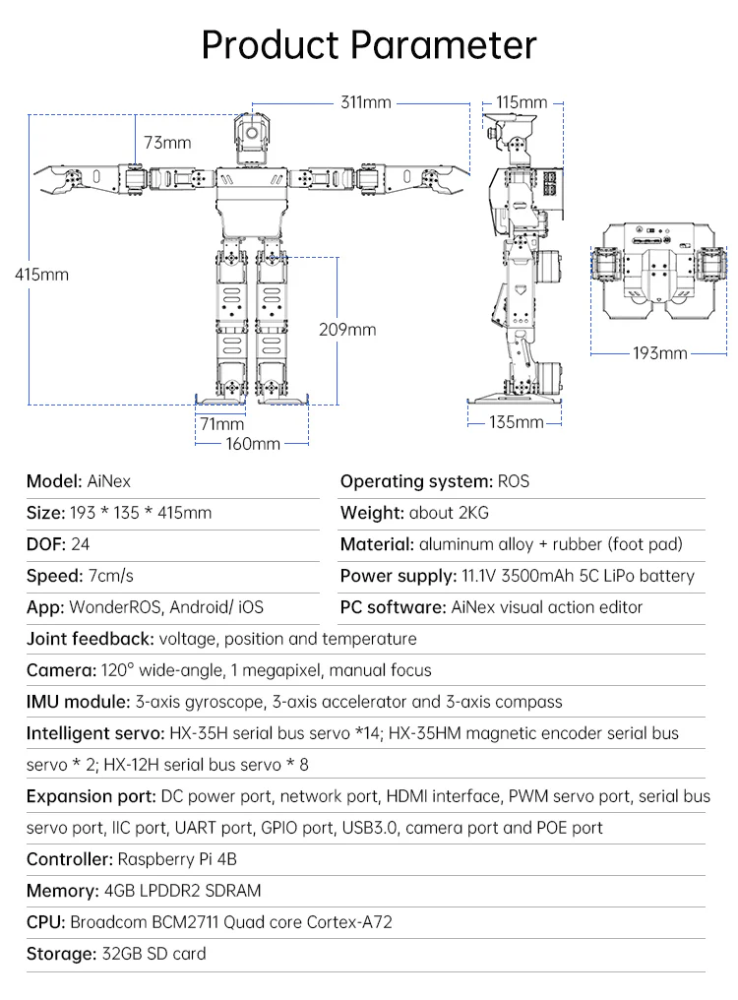

# 🤖 Orca Robot Project

Welcome to the **Orca Robot Project** 🤗! This repository brings together a complete and versatile robotics platform, featuring multiple sub-packages designed to handle robotic reinforcement learning, multimodal interaction, and smart home integration. Below is a detailed guide to help you get started with each component of the project.


## 📁 Folder Structure

```plaintext
orca_robot/
├── colcon_ws/
│   └── src/
│       └── OrcaRL2/             # OrcaRL package for ROS2
├── OrcaVA/                      # Multimodal assistant package
├── OrcaHACS/                    # Integrations for Home Assistant package
├── docs/                        # Documentation and images
├── nano_build_opencv/           # Package for building OpenCV with CUDA
└── ros2_setup_scripts_ubuntu/   # Set of scripts to install ROS
```

## 📚 Installation Guide

### 🛠️ Prerequisites

Before you begin, ensure you have the following installed on your system:

- **ROS2 Humble** or later
- **Docker** (for containerized components)
- **Python 3.10+**
- **Home Assistant** (for HACS integration)

### 📝 Setting Up the Workspace

1. 🛠️ Prepare the host machine:
```bash
   echo '
   prevent_colcon_build() {
      forbidden_dir="$HOME/Orca_Robot"
      allowed_dir="$HOME/Orca_Robot/colcon_ws"

      # Check if the current directory is exactly the forbidden directory
      if [[ "$PWD" == "$forbidden_dir" ]]; then
         echo "**************************************************************"
         echo "ERROR: You are attempting to build in a forbidden directory!"
         echo "Please build only inside $allowed_dir"
         echo "**************************************************************"

         echo "Deleting build/, install/, and log/ directories..."
         rm -rf "$forbidden_dir/build" "$forbidden_dir/install" "$forbidden_dir/log"

         return 1  # Prevent colcon from continuing
      fi
   }

   # Hook into colcon build
   alias colcon="prevent_colcon_build && colcon"
   ' >> ~/.bashrc

   exec bash
   ```
2. 📂 Clone the repository:
```bash

   git config --global user.name "FIRST_NAME LAST_NAME"
   git config --global user.email "MY_NAME@example.com"

   git clone https://github.com/Curiosity-AI-team/Orca_Robot --recursive
   cd Orca_Robot
   ```

### 🚀 Running OrcaRL

OrcaRL provides tools and environments for integrating ROS on robots.

1. 🔄 Navigate to the OrcaRL package:
```bash
   cd colcon_ws/src/OrcaRL2
   ```
2. Install ROS using bash script:
```bash
   ./orca_robot/ros2_setup_scripts_ubuntu/ros2-humble-desktop-main.sh
   source /opt/ros/humble/setup.bash
   echo "source ~/orca_robot/colcon_ws/install/setup.bash" >> ~/.bashrc
   # pip install -r ~/orca_robot/colcon_ws/src/OrcaRL2/requirements.txt
```

For detailed usage, see the [OrcaRL Documentation](colcon_ws/src/OrcaRL2/README.md).

### 🚀 Running OrcaVA

OrcaVA is a multimodal assistant capable of handling voice commands and text inputs.

1. 🔄 Navigate to the OrcaVA directory:
```bash
   cd OrcaVA
   ```

Refer to the [OrcaVA User Guide](OrcaVA/README.md) for more information on setup and configuration.

### 💪 Setting Up OrcaHACS

OrcaHACS contains custom components and integrations for Home Assistant.

1. 🔒 Copy the contents of the `HACS` folder to your Home Assistant `custom_components` directory.
2. 🔄 Restart Home Assistant.
3. 🔍 Add the new integrations via the Home Assistant UI.

For details on available integrations, see the [OrcaHACS Documentation](OrcaHACS/README.md).

## 🧶 Hardware
Although this project theoretically works on various platforms, we provide our humanoid robot with all the necessary packages and tools pre-installed for a starting experience. If you are interested in obtaining our hardware solution, please contact us to place an order.



## 👨‍💼 Sponsor the Project
This project is open source, and we welcome contributions from the community. If you would like to support the continued development of this project, you can sponsor us. Your sponsorship will help us improve the project, add new features, and ensure its long-term maintenance.

To learn more about sponsorship opportunities, please reach out to us or visit the project’s sponsorship page.

## 🔒 License

This project is licensed under the MIT License. See the [LICENSE](LICENSE) file for more details.

## 📧 Contact

If you have any questions or need further assistance, feel free to contact us:

- **📧 Email:** vmd000200000088@gmail.com
- **📘 GitHub Issues:** [Issue Tracker](https://github.com/Curiosity-AI-team/Orca_Robot/issues)

