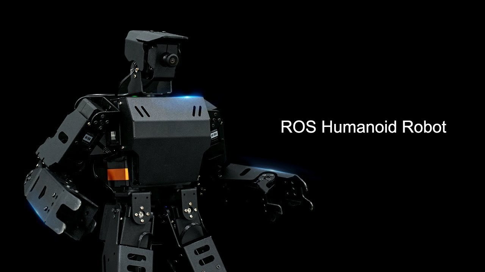

# 🤖 Orca Robot Project

Welcome to the **Orca Robot Project**! This repository brings together a complete and versatile robotics platform featuring multiple sub-packages designed to handle robotic reinforcement learning, multimodal interaction, and smart home integration. Below is a top-level guide to get you started, along with links to additional documentation.



---

## 📁 Folder Structure

A typical folder structure might look like this:

```plaintext
orca_robot/
├── colcon_ws/
│   └── src/
│       └── OrcaROS/                # OrcaROS package for ROS2
├── OrcaVA/                         # Multimodal assistant package
├── OrcaHACS/                       # Integrations for Home Assistant
├── docs/                           # Documentation and images
├── nano_build_opencv/              # Scripts for building OpenCV with CUDA
└── ros2_setup_scripts_ubuntu/      # Scripts to install ROS
```

---

## 🧩 Additional Setup Guides

Depending on your needs, consult the following files in the `docs/` folder (or at the root of the repository) for more targeted instructions:

1. **[HardwareHelper.md](docs/HardwareHelper.md)**  
   Detailed instructions on configuring hardware (Jetson, CAN, I2C, SSH, ODrive, etc.).

2. **[INSTALL_DESKTOP.md](docs/INSTALL_DESKTOP.md)**  
   Steps for setting up a desktop-based ROS environment, including required dependencies, building from source, and more.

3. **[INSTALL_ROBOT.md](docs/INSTALL_ROBOT.md)**  
   Installation process for a **headless** robot system running Ubuntu 22.04 or a Jetson device.

4. **[MANUAL.md](docs/MANUAL.md)**  
   How to run simulations, set up SLAM, launch navigation, manage tasks, and more.

5. **[DockerHelper.md](docs/DockerHelper.md)**  
   A guide to installing and managing Docker on Ubuntu for containerized development.

6. **[GITHelper.md](docs/GITHelper.md)**  
   Essential Git commands, handling submodules, and repository organization.

---

## 📚 Installation and Workspace Setup

Below is a brief overview of how to set up the **Orca Robot Project**. **Please note** that each subsystem (like `OrcaVA`, `OrcaHACS`, or `OrcaROS`) may have additional dependencies described in their respective README files.

1. **Clone the Repository (with Submodules):**

   Refer to **[GITHelper.md](docs/GITHelper.md)** for detailed commands on initializing and updating submodules. 
   ```bash
   git clone https://github.com/Curiosity-AI-team/Orca_Robot.git --recursive
   cd Orca_Robot
   ```

2. **Configure ROS & Install Dependencies:**

   - For a desktop environment, follow **[INSTALL_DESKTOP.md](docs/INSTALL_DESKTOP.md)**.
   - For a robot (headless) environment, follow **[INSTALL_ROBOT.md](docs/INSTALL_ROBOT.md)**.

3. **Build the ROS Packages:**

   ```bash
   cd colcon_ws
   colcon build --symlink-install
   ```
   *(Make sure to follow the environment setup steps from the relevant install guide.)*

---

## 🚀 Running OrcaROS

OrcaROS provides tools and environments for integrating ROS on robots using reinforcement learning. Once your workspace is built:

1. **Navigate to OrcaROS**:

   ```bash
   cd ~/orca_robot/colcon_ws/src/OrcaROS
   ```

2. **Source the Environment**:

   ```bash
   source /opt/ros/${ROS_DISTRO}/setup.bash
   source ~/orca_robot/colcon_ws/install/setup.bash
   ```

3. **Run Demos / Launch Files** (example):

   ```bash
   ros2 launch orca_navigation navigation2.launch.py
   ```

*(For more details on how to run simulations, localize, or navigate, see [MANUAL.md](MANUAL.md).)*

---

## 🗃️ Docker Setup

If you prefer containerized development or plan to run the project in Docker:

- Check **[DockerHelper.md](docs/DockerHelper.md)** for detailed Docker installation and usage commands.
- Build or pull the Docker images as per your development needs.

Example:
```bash
docker build -t your_orca_robot_image .
docker run -it --rm your_orca_robot_image
```

---

## 💪 OrcaHACS (Home Assistant Integrations)

1. **Copy** the relevant custom components from `OrcaHACS/` into your Home Assistant `config/custom_components`.
2. **Restart** Home Assistant.
3. **Configure** new integrations through the Home Assistant UI.

*(Detailed instructions found in `OrcaHACS/README.md`.)*

---

## 🏭 Hardware Configuration

If you’re working with hardware like:

- **NVIDIA Jetson** (Orin, Nano, Xavier, etc.)
- **Motor drivers (ZLAC8030L, ODrive)**
- **Sensors (LIDAR, IMU, etc.)**

Refer to **[HardwareHelper.md](docs/HardwareHelper.md)** for step-by-step instructions on enabling interfaces, setting up can0, I2C, installing additional drivers, etc.

---

## 🎯 Subpackage Details

1. **OrcaROS** (ROS2 & Reinforcement Learning)  
   Located at `colcon_ws/src/OrcaROS`. Main functionalities include SLAM, navigation, and RL-based planning.  

2. **OrcaVA** (Multimodal Assistant)  
   Provides modules for voice and text-based interaction.  

3. **OrcaHACS** (Home Assistant Components)  
   Smart-home integrations and custom components for controlling devices via Home Assistant.  

---

## 👨‍💼 Sponsor the Project

This project is open-source, and we appreciate community support. Sponsors help us add new features, improve the codebase, and maintain long-term stability. For more information, please contact us or visit the project’s sponsorship page.

---

## 🔒 License

This project is licensed under the **MIT License**. See the [LICENSE](LICENSE) file for more details.

---

## 📧 Contact

For questions, issues, or additional support:

- **Email:** vmd000200000088@gmail.com  
- **GitHub Issues:** [Issue Tracker](https://github.com/Curiosity-AI-team/Orca_Robot/issues)

---

**Happy Hacking with Orca Robot Project!**